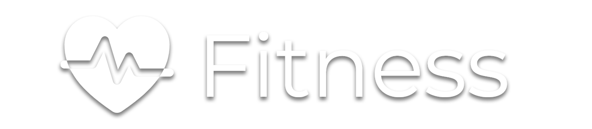

  

# Fitness-Landing-Page
The Fitness Landing Page is a web application designed to fitness business website. I decided to create it using React.js and Pure CSS. The landing page provides a visually appealing and user-friendly, animations interface to display Fitness services, package attracting potential visitors. The landing page is built using modern web technologies and is fully responsive for an optimal viewing experience across devices.

## Features

- Fitness landing page with stunning visuals.
- Responsive design for seamless viewing on various devices.
- Artistic animations and interactive elements for an engaging user experience.
- Smooth navigation between sections with the Navbar and scolling.

## Technologies & Tools Used
- React.js
- CSS
- Framer Motion
- SmoothScoller

